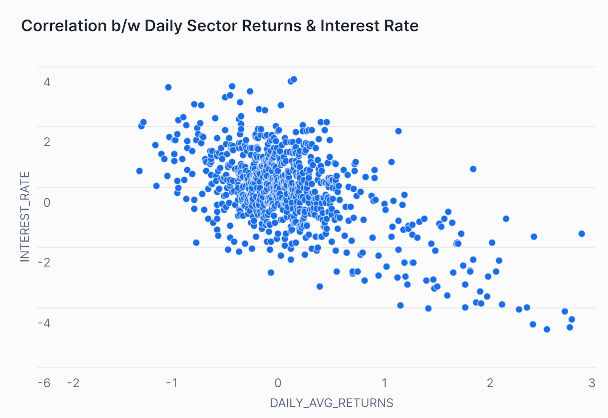
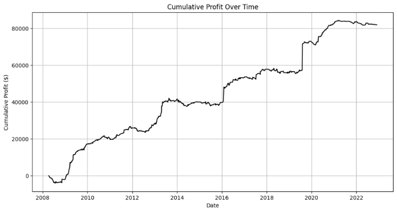
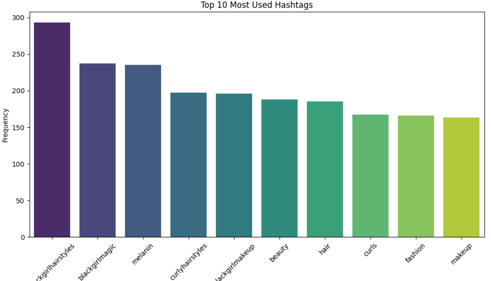

    <h1 style="color: #2774ae ; margin-right: 10px;">DATA SCIENCE PROJECTS</h1>

  <h3 style='color:#222;'>Monetary Policy Impact Analysis: SQL-Driven Sector Performance Evaluation</h3>
<em><strong>Business Problem:</strong> How does an expansionary monetary policy (interest rate cuts) affect different economic sectors, and can we quantify its asymmetric impact?</em>
   
  

  
  For the Central Bank of Gondwana, I analyzed whether their 2023–2024 rate cuts boosted manufacturing sector returns while inadvertently harming financial firms—a critical question for future policy design. Using SQL-based time-series analysis, I evaluated the impact of Gondwana’s monetary policy across key sectors. By segmenting data into Pre-Policy, During-Policy, and Post-Policy periods, I identified:

<li><strong>38% surge in manufacturing returns</strong> during the rate cuts, sustained at <strong>6% above pre-policy levels</strong></li>
<li><strong>Declining financial sector performance</strong> due to compressed bank profit margins from lower interest rates</li>
<li><strong>Validated policy timing</strong> through inflation/interest rate trends using moving averages (2-week to 6-month windows)</li>

The analysis combined 280K+ corporate records with macroeconomic indicators to isolate sector-specific effects, leveraging:
    <li>SQL window functions</li>
    <li>Multi-table joins</li> 
    <li>Dynamic aggregations</li>
  

  

      
    
    
    
  

  

    

      
<strong>Figure 1:</strong> Macro Economic Indicator 

      
    

    

      
<strong>Figure 2:</strong> Pre-During-Post Analysis 

      
    

    

      
<strong>Figure 3:</strong>Correlation: Daily Sector Returns & Interest Rate

      
    

    

      
<strong>Figure 4:</strong> Daily Avg Manufacturing Returns 

      
    

    

      
<strong>Figure 5:</strong> Interest rate Vs Daily Avg Return 

      
    

  

  <h3 style='color: #222 ;'>SumZero Investment Thesis Driven Trading Strategy</h3>
  <em><strong>Business Problem:</strong> How can we make sense of text-based investment ideas on our website to create trading strategies and improve stock market returns?</em>
   
  

  At SumZero, Inc., I led a team to develop a trading strategy by integrating NLP and ChatGPT with S&P 500 stock price data from Yahoo Finance. I analyzed over 1,000 investment theses from SumZero using OpenAI’s API, achieving a sentiment analysis accuracy of 95.51%. By assigning trading signals (1 for bullish, -1 for bearish, 0 for neutral) and incorporating a stop-loss mechanism, our strategy delivered strong performance metrics, including a high Profit/Max Equity ratio and a positive Sharpe Ratio. We also explored the extraction of non-GAAP metrics for further analysis.
  

  

  
  
  
  

  

    

      
<strong>Figure 1:</strong> Sumzero Sentiment Accuracy

      
    

    

      
<strong>Figure 2:</strong> Mean Annualized Returns

      
    

    

        
<strong>Figure 3:</strong> Cumulative Profit

        
    

  

  <h3 style='color:#222;'>Seismic Insights: Real-Time Earthquake Tracking with Google Cloud</h3>
<em><strong>Business Problem:</strong> How can we automate real-time earthquake tracking and present the updates in a simple, user-friendly way for everyone?</em>
   
  

  
  I developed a solution to automate the collection and organization of real-time earthquake data from the Southern California Earthquake Data Center (SCEDC) using Google Cloud. I created a Python-based Google Cloud Function that retrieves critical earthquake details—magnitude, location, depth, and timestamp—and updates a Google Sheet in real time, ensuring seamless data synchronization without manual intervention. To make the process even more user-friendly, I built an optional Flask app that provides a simple interface to trigger updates and visualize the data. By integrating tools like gspread and oauth2client, this scalable, cloud-powered project makes tracking seismic activity accessible for both technical users and the general public.
  

  

  
  
  
  

 <a href="https://github.com/Github4Aakanksha/Real-Time-Earthquake-Tracking"
     style="
       display: inline-block;
       padding: 10px 20px;
       background-color:#003B5C;
       color: white;
       text-decoration: none;
       border-radius: 10px; /* Curved edges */
       font-size: 0.9em;
       font-family: Arial, sans-serif;
       box-shadow: 2px 2px 5px rgba(0, 0, 0, 0.2); /* Optional shadow for button effect */
     ">View project on GitHub</a>

  

    

      
<strong>Figure 1:</strong> SCEDC Earthquake Map

      
    

    

      
<strong>Figure 2:</strong> Earthquake Table SCEDC

      
    

    

      
<strong>Figure 3:</strong> Updated Google Sheets

      
    

  

  <h3 style='color:#222;'>Sectoral PE Analysis & Trading Strategy with Machine Learning</h3>
<em><strong>Business Problem:</strong> How can we use price-to-earnings ratios from different sectors to create a balanced portfolio that improves investment decisions, trading results, and reduces risk?</em>
    
  

  I developed a trading strategy using machine learning based on sectoral price-to-earnings (PE) ratios from the health and industrial sectors. By normalizing the data with Fisher transformations and fine-tuning buy/sell signals, I evaluated the strategy using metrics such as the Sharpe ratio and annual returns. When I combined the best strategies from both the health and industrial sectors into one equally-balanced portfolio, it showed that using data-driven methods can lead to better investment decisions and improved trading results.
  

  
  

  
  
  
  
  

  
  <a href="https://github.com/Github4Aakanksha/ML/blob/main/Sectoral%20PE%20Analysis%20and%20Trading%20Strategy%20ML.ipynb" style="
       display: inline-block;
       padding: 10px 20px;
       background-color:#003B5C;
       color: white;
       text-decoration: none;
       border-radius: 10px; /* Curved edges */
       font-size: 0.9em;
       font-family: Arial, sans-serif;
       box-shadow: 2px 2px 5px rgba(0, 0, 0, 0.2); /* Optional shadow for button effect */
     ">View project on GitHub</a>

  

    

      
<strong>Figure 1:</strong> Health Sector Trading Strategy

      
    

    

      
<strong>Figure 2:</strong> Industrial Sector Trading Strategy

      
    

  

  <h3 style='color: #222;'>Flask Application- Instagram Caption Analysis</h3>
  <em><strong>Business Problem:</strong> How can we help content creators improve their social media posts?</em>
    
  

At Next Step Projects,  I led the development of a Flask application that analyzes Instagram captions for sentiment and extracts hashtags. The application takes an Instagram caption as input and provides the sentiment polarity, subjectivity, and any hashtags present in the caption. My goal was to develop a tool that helps content creators understand the emotional tone of their captions and identify popular hashtags, ultimately enabling them to craft more engaging and impactful posts on Instagram.
  

  
  
  
  

  <a href="https://github.com/your-repo-link" style="
       display: inline-block;
       padding: 10px 20px;
       background-color:#003B5C;
       color: white;
       text-decoration: none;
       border-radius: 10px; /* Curved edges */
       font-size: 0.9em;
       font-family: Arial, sans-serif;
       box-shadow: 2px 2px 5px rgba(0, 0, 0, 0.2); /* Optional shadow for button effect */
     ">View project on GitHub</a>

  

    

      
<strong>Figure 1:</strong> Sentiment Polarity

      
    

    

      
<strong>Figure 2:</strong> Top 10 Hashtags

      
    

  

  <h3 style='color: #222;'>Sentiment Analysis- Forex Trading Strategy</h3>
  <em><strong>Business Problem:</strong> How can we leverage economic news sentiment to create a Forex trading strategy that consistently outperforms the market standards?</em>
    
  

In this project, I used the NY Times API to extract economic news articles and headlines, focusing on content mentioning the British Pound, and then analyzed the text to uncover sentiment trends and patterns that could influence Forex trading decisions. I developed a Forex trading strategy to predict GBP/USD exchange rate movements using NLP and machine learning. I conducted sentiment analysis on economic news extracted via the NY Times API from 2003 to 2024 and created two strategies: Strategy A, which generates trading signals through NLP-based sentiment analysis, and Strategy B, which employs predictive analytics for market trend forecasting. I rigorously optimized both strategies through backtesting and hyperparameter tuning, achieving a 1.4% annualized return and outperforming the HFRI Currency Index.
  

  
  
  
  

  <a href="https://github.com/athk13/FX-Sentiment-Analysis-Trading-Strategy" style="
       display: inline-block;
       padding: 10px 20px;
       background-color:#003B5C;
       color: white;
       text-decoration: none;
       border-radius: 10px; /* Curved edges */
       font-size: 0.9em;
       font-family: Arial, sans-serif;
       box-shadow: 2px 2px 5px rgba(0, 0, 0, 0.2); /* Optional shadow for button effect */
     ">View project on GitHub</a>

  

    

      
<strong>Figure 1:</strong> Trading Signal Chart

      
    

    

      
<strong>Figure 2:</strong> Strategy Equity Curve

      
    

    

      
<strong>Figure 3:</strong> Hyperparameter Optimization Heatmap

      
    

  

  <h3 style='color: #222;'>Web Scraping Project- Faculty Information from IIM Ahmedabad</h3>
  <em><strong>Business Problem:</strong> How can we automate the extraction of detailed faculty information from dynamic websites for efficient data analysis and research? </em>
    
  

To streamline the process of gathering faculty information for research or organizational needs, I developed a web scraping tool using Selenium, Regex, and BeautifulSoup to extract faculty information from the dynamic IIM Ahmedabad website. The script automates the process of navigating the site, interacting with various elements, and extracting relevant data such as faculty names, professions, areas of expertise, educational qualifications, and research areas from individual profile cards. It efficiently handles multiple pages by clicking through to next pages until all faculty profiles are scraped, ultimately storing the data in a Pandas DataFrame for further analysis.
  

  
  
  
  

  <a href="https://github.com/Github4Aakanksha/ML/blob/main/Webscraping%20Assessment.ipynb" style="
       display: inline-block;
       padding: 10px 20px;
       background-color:#003B5C;
       color: white;
       text-decoration: none;
       border-radius: 10px; /* Curved edges */
       font-size: 0.9em;
       font-family: Arial, sans-serif;
       box-shadow: 2px 2px 5px rgba(0, 0, 0, 0.2); /* Optional shadow for button effect */
     ">View project on GitHub</a>

  

    

      
<strong>Figure 1:</strong> IIMA Homepage

      
    

    

      
<strong>Figure 2:</strong> IIMA Faculty Page

      
    

  

  <h3 style='color: #222;'>Macroeconomic Time Series Analysis using VAR Models</h3>
  <em><strong>Research Problem:</strong> How do key economic indicators like inflation, unemployment, and the Federal Funds rate interact and influence each other over time, and how can these relationships be used for forecasting? </em>
    
  

In this project, I conducted time series analysis using Vector Auto-regression (VAR) models to replicate the findings of Stock and Watson’s 2001 paper. By analyzing key economic indicators like Inflation, Unemployment, and the Federal Funds Rate, I use tools like PACF plots, Granger Causality tests, and Factor Error Variance Decomposition (FEVD) to understand their interrelationships. These included exploring the direction of influence between them and understanding the contributions of each variable to forecast error variance. I also conducted impulse response analysis to evaluate the short-term impact of shocks to the system. The models forecast these indicators two years forward, providing insights into how economic factors influence each other and enhancing the accuracy of macroeconomic forecasting and policy analysis.
  

  
  
  
  

  

  <a href="https://github.com/Github4Aakanksha/ML/blob/main/Time%20Series%20VAR%20Forecasting.ipynb" style="
       display: inline-block;
       padding: 10px 20px;
       background-color:#003B5C;
       color: white;
       text-decoration: none;
       border-radius: 10px; /* Curved edges */
       font-size: 0.9em;
       font-family: Arial, sans-serif;
       box-shadow: 2px 2px 5px rgba(0, 0, 0, 0.2); /* Optional shadow for button effect */
     ">View project on GitHub</a>

  

    

      
<strong>Figure 1:</strong> Impulse Response Plots

      
    

    

      
<strong>Figure 2:</strong> PI Forecast Plot

      
    

    

      
<strong>Figure 3:</strong> Inflation Forecast Plot

      
    

    

      
<strong>Figure 4:</strong> Unemployment Forecast Plot

      
    

  

